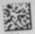
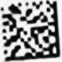

Super Resolution
==============
All of this methods is implementation in caffe python.

### Instruction

* VDSR (Very Deep network for Super-Resolution) is an end-to-end network with 20 convolutional layers for single image super-resolution. [[Web]](http://cv.snu.ac.kr/research/VDSR/)

* SRCNN (Image Super-Resolution Using Deep Convolutional Networks) [[Web]](http://mmlab.ie.cuhk.edu.hk/projects/SRCNN.html)

* FSRCNN (Accelerating the Super-Resolution Convolutional Neural Network) [[Web]](http://mmlab.ie.cuhk.edu.hk/projects/FSRCNN.html)

### How to training in my code
First of all. I use Super-Resolution to do data matrix reader (Enhance picture quality).
My platform is Ubuntu 14.04 with pycaffe.

#### 1. Install libdmtx

Download source code from this [site](https://sourceforge.net/p/libdmtx/dmtx-wrappers/ci/master/tree/). 
And then following readme to build and install libdmtx. Also do python setup.py install to install python wrapper name pydmtx.

#### 2. Set environment variable
```
    export LD_LIBRARY_PATH=/usr/local/lib/:$LD_LIBRARY_PATH
    export PYTHONPATH=`pwd`:$PYTHONPATH
```
#### 3. Start to training
```
    caffe train --solver=solver.prototxt --gpu=0
```

### Result compare

* VDSR

 VS 

* SRCNN

 VS 

